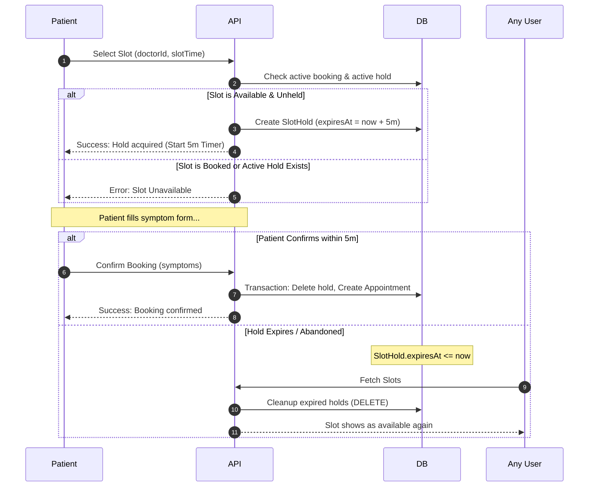

# System Design: Healthcare Appointment & Follow-up Manager

This document details the architectural solutions implemented to solve core operational challenges in scheduling: double-booking prevention, doctor leave conflicts, slot hold management, and notification delivery reliability.

---

## 1. Double-Booking Prevention
To ensure a time slot is never booked by more than one patient, we implement database-level integrity combined with serializable-like isolation guarantees:
1. **Unique Indices**: The `SlotHold` table has a composite unique constraint: `@@unique([doctorId, slotTime])`. This database index prevents concurrent duplicate holds at the physical disk level.
2. **Transaction Isolation**: During the confirmation step (booking), the system executes a single ACID transaction containing two validation reads followed by atomic modifications:
   - It queries the `Appointment` table to assert that no active booking exists for the given doctor at the slot time.
   - It asserts that the requesting patient has a valid, active hold on the slot.
   - Upon confirmation, it deletes the slot hold and inserts the appointment.
3. If two patients attempt to click "Book" simultaneously, the database block transaction locks the tables. The first transaction commits successfully, causing the second to fail the initial read check and return a clean "This slot is already booked" exception.

---

## 2. Doctor Leave Conflict Handling
When an administrator places a doctor on leave for a target date, we implement automated conflict detection and cascades:
1. **Time Boundaries**: The leave date (e.g. `2026-07-04`) is mapped into UTC start-of-day and end-of-day timestamps.
2. **Batch Query & Update**: We query the `Appointment` table for all bookings matching the doctor ID within those boundaries where `status = 'BOOKED'`.
3. **Transaction Safety**: Inside a database transaction, all conflicting appointments are set to `CANCELLED_BY_DOCTOR`. This blocks subsequent queries from considering these slots as booked.
4. **Patient Notification**: For each cancelled appointment, the system automatically inserts a row into the `Notification` log table with a status of `PENDING`. An asynchronous email task is fired to notify the patient.

---

## 3. Slot Hold Mechanism
To prevent a patient from losing a slot while filling out the pre-visit symptom form, we implement a reservation lock with a Time-To-Live (TTL):

The 5-minute expiry is enforced by:
- Storing an `expiresAt` timestamp in the `SlotHold` table.
- Filtering out holds where `expiresAt <= now()` in the schedule generator API.
- Cleaning up expired holds asynchronously during background worker loops to free database storage.

---

## 4. Notification Failure Handling
To guarantee email notifications and medication reminders are delivered reliably despite API or SMTP server downtimes, the system utilizes a **Transactional Outbox Pattern**:
1. **Persistent Logging**: All outgoing notifications (appointment confirmations, cancellations, medication alerts) are written to a database `Notification` log table with details and a status of `PENDING`, `SENT`, or `FAILED`.
2. **Asynchronous Retry Worker**: The background jobs runner `/api/jobs/run` periodically polls the `Notification` table:
   - It fetches rows where `status = 'FAILED'` and `retryCount < 3`.
   - It attempts to re-send the email payload.
   - If sending succeeds, it marks the status as `SENT` and clears errors.
   - If sending fails, it increments the `retryCount` and logs the error details.
3. **Audit Trails**: This outbox pattern decouples the booking transaction from external API latencies, ensuring the app remains fast and responsive while providing full delivery audit logs.
